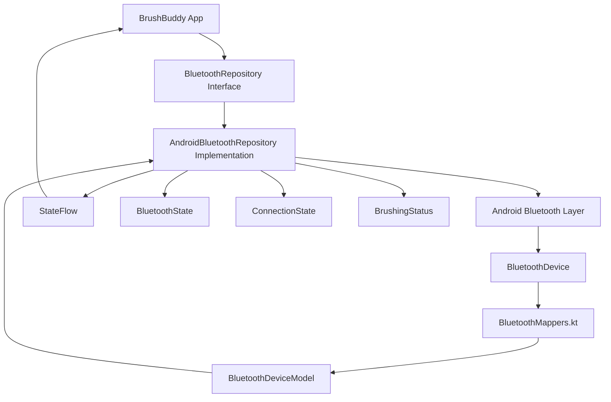

# BrushBuddy-Android-App
An Android pp built with Kotlin and Jetpack Compose, designed to track brushing habits, encourage consistent routines, and integrate with Bluetooth toothbrushes.

## MVP

The first version of BrushBuddy focuses on building healthy brushing habits.

The MVP will:

- Track brushing sessions
- Record brushing history
- Track the number of completed brushing sessions
- Encourage brushing at least twice per day
- Build a daily brushing streak
- Remind the user if the daily brushing goal has not been completed

For the initial version, brushing sessions will be started manually in the app. In a future version, I plan to explore Bluetooth integration with a smart toothbrush so brushing activity can be detected automatically.

## Current Progress

- Home screen UI
- Home, History and Profile navigation
- Bottom navigation bar using Jetpack Compose
- Brushing goal and statistics UI

## Learning Resources

This project is also being used to practise concepts covered in the Bilue Android Academy for Women.

Resources I have followed during development:

- Bilue Android Academy:
  https://academy.bilue.com.au/dashboard.html

- Bottom Navigation Bar with Jetpack Compose:
  https://www.geeksforgeeks.org/kotlin/bottom-navigation-bar-in-android-jetpack-compose/
  
## Bluetooth Architecture

Bluetooth support is being added using the Repository Pattern to keep
Android-specific Bluetooth logic separate from the rest of the application.

Current structure:

- `BluetoothRepository` – An interface that defines the Bluetooth operations required by the app.
- `AndroidBluetoothRepository` – Android-specific implementation of the BluetoothRepository.
- `BluetoothDeviceModel` – App-level representation of a discovered Bluetooth device.
- `BluetoothState` – Represents Bluetooth states such as enabled, off, or unauthorized.
- `ConnectionState` – Represents device connection states.
- `BrushingStatus` – Represents the brushing status received from the toothbrush.
- `BluetoothMappers` – Converts Android `BluetoothDevice` objects into BrushBuddy's
  `BluetoothDeviceModel`.
- `StateFlow` – Exposes observable Bluetooth state while keeping mutable state private
  inside the AndroidBluetoothRepository.

Bluetooth runtime permissions are also handled differently depending on the
Android version.

### Current Progress

- [x] Bluetooth repository interface
- [x] Android repository implementation structure
- [x] Bluetooth models
- [x] Bluetooth device mapper
- [x] Runtime Bluetooth permissions
- [x] Read paired/bonded devices
- [ ] Scan for nearby Bluetooth devices
- [ ] Connect to the toothbrush
- [ ] Discover BLE services and characteristics
- [ ] Receive brushing data
- [ ] Integrate Bluetooth events with the brushing session state

